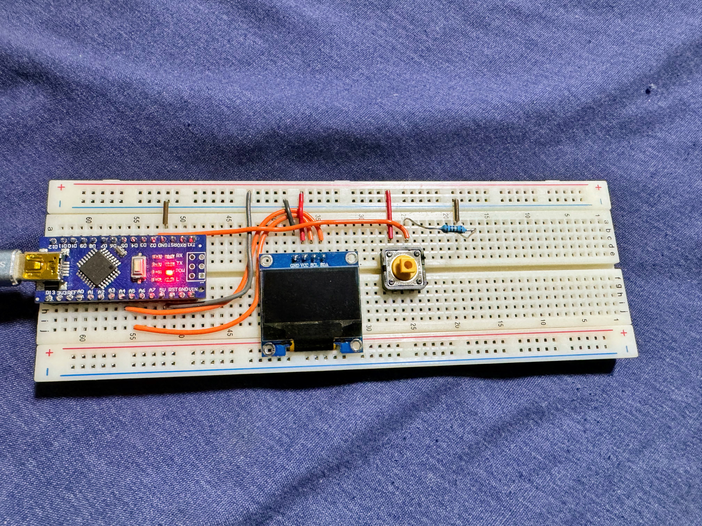

# morseCode
I saw a video where someone had a keyboard with only one key plugged into their computer, and they were able to type out the full alphabet using just morse code. I decided I wanted to try building this using just an OLED screen and Arduino Nano. This is also something I could use in the future when I would like to save strings on a display and only want to use one button.

Video Demonstration: 
https://photos.app.goo.gl/WeYYbBNTDBWxDd9L9

Rough Order of Events/Timeline
- make the function to go from dots and dashes to a character and test it with the serial monitor
- connect the buttons and debounce them correctly (using code and not capactitors)
- make it so that an LED turns on each time the button is held, and when the button is released, the time that the button was held for is displayed to the screen
- get it working so that depending on how long the button is pressed for, the press is registered as a dot or dash, and if it is released for a long time, then the following click is considered as enter
- make it so that when the button is pressed, a dot or dash is concatenated to the string, then once an enter occurs, the string is passed into the function and made into a character, and this is displayed to the Serial monitor
- make it so that a long button press is treated as a backspace
- connect the OLED to the Arduino nano and make sure it works
- test and tweak the delay times, and make some changes for the display to work as desired

Last Updated: March 15th 2024 

Possible Improvements: 
- use a button with a spring to improve the experience
- make the times for dots and dashes faster so it doesn't take so long to print one word
- make it so that there is no need for the enter button, when the button is unpressed for a certain amount of time, it is considered as an enter
- make a blinking cursor on the screen 
